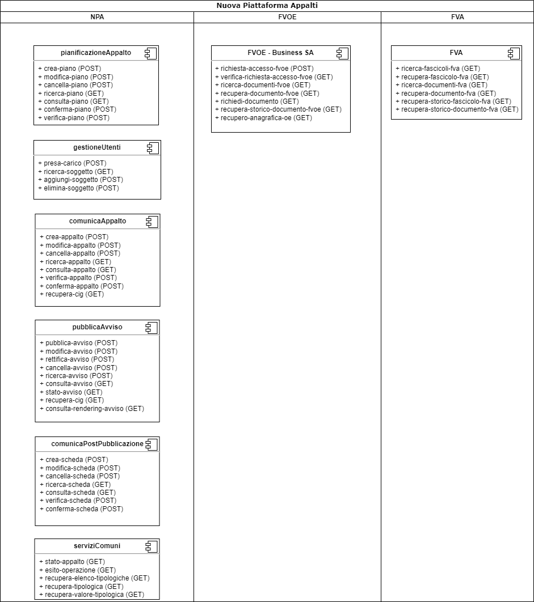
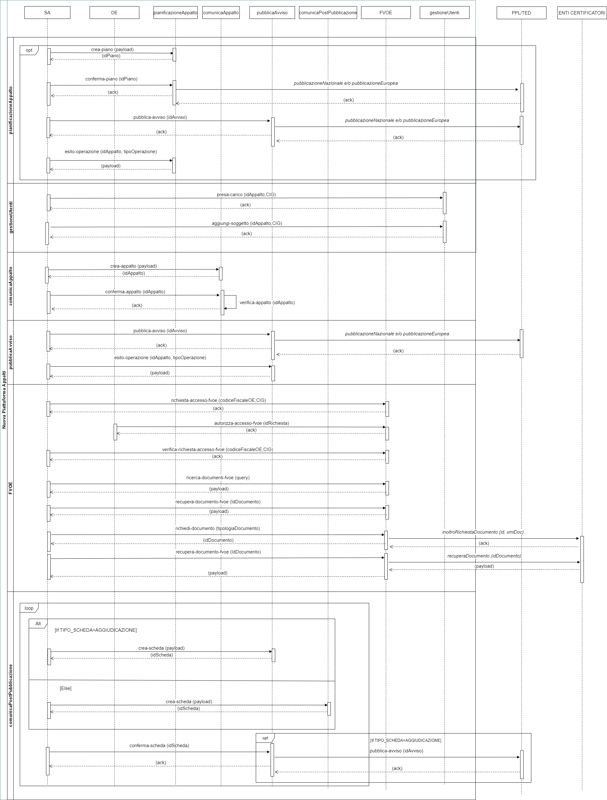
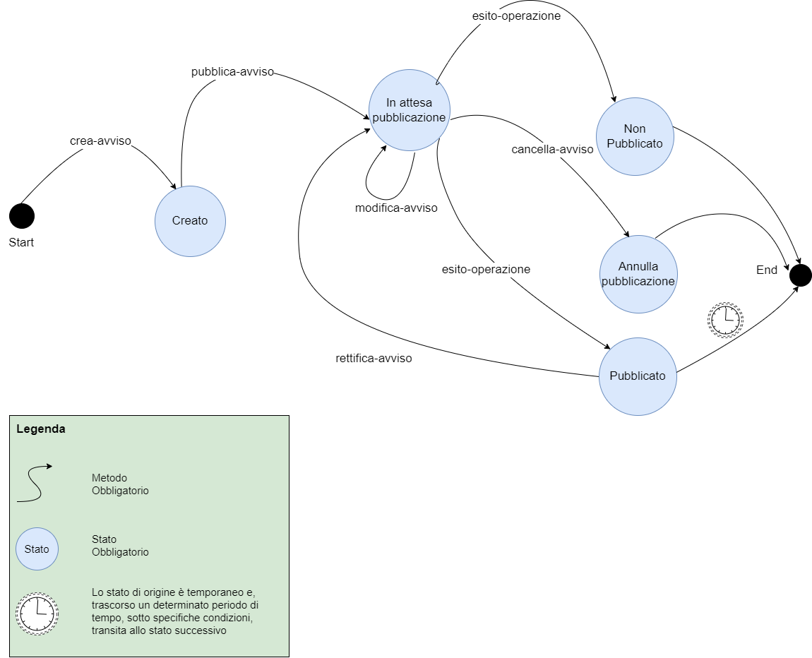
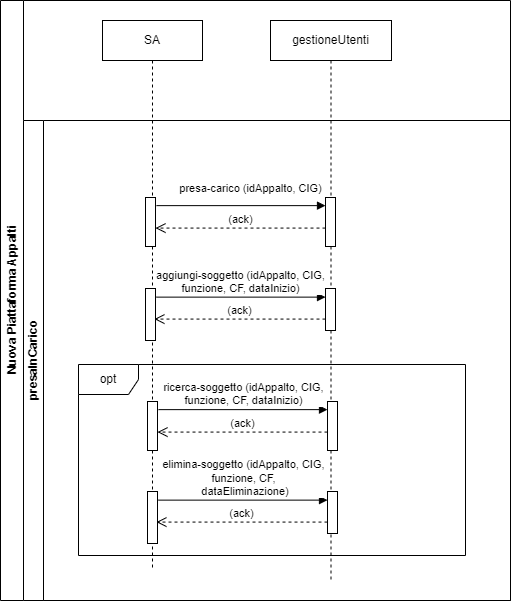
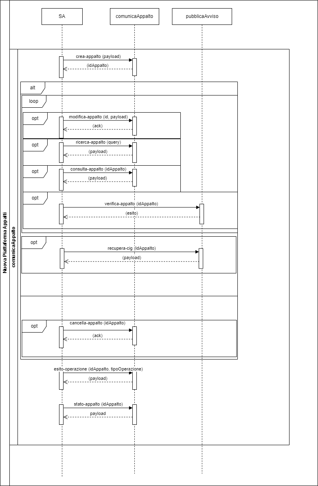
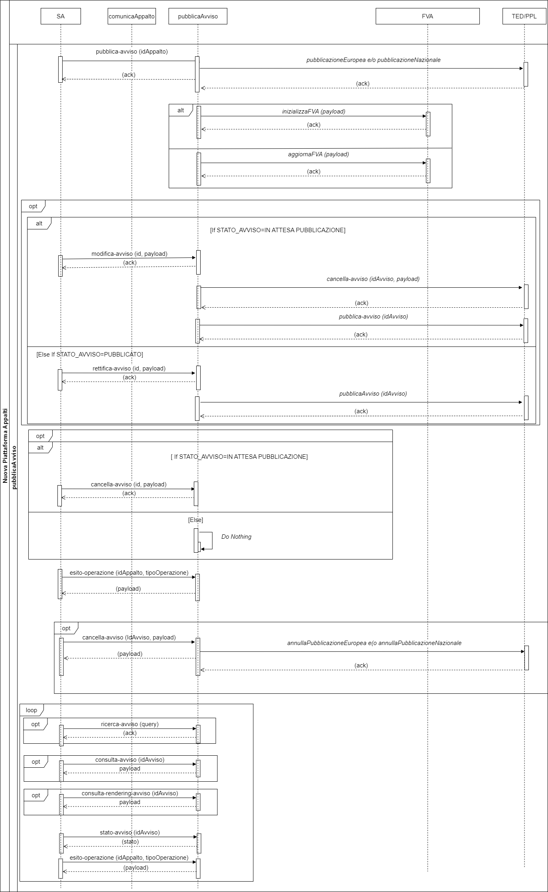
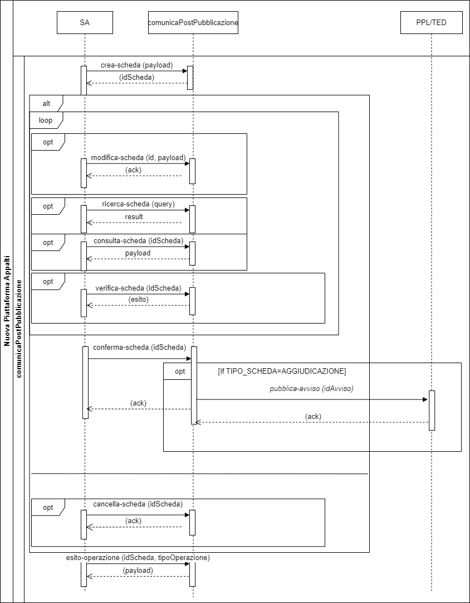

# 1 Definizioni, acronimi e riferimenti
  ## 1.1 Definizioni e acronimi
  
  | Termine/Acronimo | Descrizione | 
  | ------------- | ------------- | 
  | ANAC  | Autorità Nazionale Anticorruzione |  
  | Autorità  | Si riferisce all’ANAC |
  | USCP  | ANAC - Ufficio Servizi IT per i Contratti Pubblici |  
  | BDNCP  | Banca Dati Nazionale dei Contratti Pubblici Anagrafe unica dei contratti pubblici. È la banca dati di riferimento di ANAC per utenze e soggetti rappresentati. |
  | MIT  | Ministero delle Infrastrutture e dei Trasporti |
  | Portale Internet  | Punto di erogazione dei servizi web per gli utenti esterni ANAC |
  | Servizi ANAC  | Nucleo centralizzato di servizi che contengono la logica di Business dell’Autorità. |
  | FVA  | Fascicolo Virtuale dell'Appalto |
  | FVOE  | Fascicolo Virtuale dell'Operatore Economico |
  | SA  | Stazione Appaltante |
  | PPL  | Piattaforma di Pubblicità legale |
  | PDND  | Piattaforma Digitale Nazionale Dati |
  | NPA  | Nuova Piattaforma Appalti, con l'acronimo si può far riferimento ai servizi specifici della componente di monitoraggio dell'appalto o in generale ai servizi erogati dai moduli NPA, FVA, FVOE |
  
  ## 1.2 Riferimenti
   -  [Agid-Specifiche tecniche per la definizione del DGUE elettronico italiano “eDGUE-IT”](https://www.agid.gov.it/sites/default/files/repository_files/edgue-it_specifiche_tecniche_v1.0.0_0.pdf)
   - [Sito Agid](https://www.agid.gov.it/)
   - [CEF](https://ec.europa.eu/inea/connecting-europe-facility/cef-telecom)
   - [IIeP](https://ec.europa.eu/inea/en/connecting-europe-facility/cef-telecom/2015-it-ia-0108)
   - [Direttiva 24/2014, Unione Europea](https://eur-lex.europa.eu/legal-content/IT/TXT/?uri=celex%3A32014L0024)
   - [E-Certis](https://ec.europa.eu/tools/ecertis/search)
   - [ESPD EU](http://ec.europa.eu/growth/single-market/public-procurement/e-procurement/espd/)
   - [eForms](https://simap.ted.europa.eu/it_IT/web/simap/eforms)
  
# 2	Obiettivo del documento 
Il presente documento ha lo scopo di illustrare le specifiche di interfaccia del sistema di digitalizzazione appalti che si articola in: Nuova Piattaforma Appalti (NPA) e dei suoi componenti:  Fascicolo Virtuale dell’Appalto (FVA) e Fascicolo Virtuale dell’Operatore Economico (FVOE). La fruizione di tali servizi è destinata alle piattaforme digitali che le Stazioni Appaltanti adottano per la gestione del ciclo di vita dell'appalto.

La NPA costituisce la piattaforma centrale nel sistema nazionale di e-procurement e assolve al monitoraggio del ciclo di vita dell'appalto nelle sue fasi principali:
  - Gestione della pianificazione degli appalti
  - Erogazione del CIG per le procedure di gara
  - Pubblicità legale dei bandi e degli avvisi in ambito nazionale e comunitario (Piattaforma Pubblicità Legale)
  - Monitoraggio e pubblicità dell'aggiudicazione
  - Monitoraggio dell'esecuzione

Il sistema concentra i servizi erogati in precedenza da diversi soggetti/sistemi in particolare:
  - Il Servizio Contratti Pubblici (SCP) del MIT per la pubblicità della programmazione e di bandi e avvisi
  - la Gazzetta Ufficiale della Repubblica Italiana (GURI) come strumento per la pubblicità legale nazionale degli appalti pubblici
  - Simog e SmartCig, per l'erogazione del CIG e il monitoraggio del ciclo di vita dei contratti

E' previsto inoltre che NPA sia l'unico eSender Nazionale verso il TED per la pubblicità a livello comunitario dei bandi e degli avvisi per gli appalti pubblici.

Il Fascicolo Virtuale dell’Appalto è il contenitore di tutte le informazioni relative ad un appalto generate dagli attori attivi nell'ambito dell'ecosistema di e-procurement e raccolte dalla NPA. La piattaforma eroga servizi di consultazioni delle informazioni raccolte.

Il sistema FVOE è un componente della NPA che aggiorna e sostituisce l'attuale versione 1.0 del Fascicolo Virtuale dell'Operatore Economico ed eroga i servizi:
  - Raccolta delle informazioni e della documentazione necessaria alla verifica dei requisiti posseduti dagli operatori economici
  - Accesso alla documentazione da parte dell'operatore economico limitatamente alla propria posizione
  - Accesso alla documentazione da parte di Stazioni Appaltanti e SOA nel corso dei procedimenti di gara e di qualificazione
  - Compilazione e gestione ESPD (EU) request/response come mezzo di identificazione degli OE e accesso rapido alle informazioni necessarie alla verifica
  - Gestione dell'elenco degli operatori economici già verificati

# 3	Architettura generale 
La nuova piattaforma mira a digitalizzare i processi dell’intero ciclo di vita dell’appalto, attraverso la realizzazione di una serie di strumenti che abilitano l’integrazione e l’interoperabilità tra le piattaforme telematiche presenti nell’ecosistema nazionale dell’e-procurement.

Di seguito si riporta una rappresentazione dell’ecosistema di approvvigionamento digitale per la gestione degli appalti pubblici:

La Nuova Piattaforma Appalti (NPA) ha lo scopo principale di monitorare l’appalto, supportando la gestione e la raccolta delle informazioni rilevanti nei processi che compongono l’intero ciclo di vita. Svolge un ruolo centrale nell'ecosistema nazionale di e-procurement mettendo a disposizione i servizi di interoperabilità per l’integrazione tra le piattaforme telematiche delle SA, gli operatori economici, gli enti certificanti il possesso dei requisiti degli operatori e i soggetti preposti alla vigilanza e al monitoraggio del mercato, con l'obiettivo della completa digitalizzazione dei flussi e delle informazioni. 

NPA quindi dispiega i servizi per l’integrazione (B2B – Business to Business) con altri sistemi esterni al dominio ANAC al fine di abilitare una completa digitalizzazione e automazione tra i diversi attori operanti nell’ecosistema appalti, sono previste anche interfacce web a supporto delle Amministrazioni che non posseggono la capacità per questo tipo di integrazione (la documentazione tecnica relativa alle interfacce utente non è pubblica e non è presente in questo repository).

La nuova architettura prevede la dematerializzazione dei flussi attraverso l’adozione degli standard e delle regole tecniche di interoperabilità tra le piattaforme, come ad esempio ModI, eForms, ESPD Request (European Single Procurement Document) per la parte di definizione ed avvio della procedura e, a seguire, ESPD Response per la componente di negoziazione.

# 4 Descrizione del contesto
L’architettura applicativa complessiva prevede le seguenti componenti:

- Nuova Piattaforma Appalti (NPA)
- Fascicolo Virtuale dell'Appalto (FVA)
- Fascicolo Virtuale Operatore Economico (FVOE)

## 4.1	Servizi
Nel seguente diagramma sono rappresentati i servizi dell’NPA esposti e fruibili dai sistemi esterni:

Nella seguente [cartella](../diagrammi-drawio/), è consultabile il diagramma drawio.

## 4.2	Flusso di Interoperabilità
Nel presente paragrafo si rappresentano i flussi di interoperabilità di tutto il ciclo di appalto attraverso l’uso del Sequence Diagram:

**Legenda:**
- *Nome servizio* = Servizi che richiamano la PPL o TED (esterne rispetto all’NPA) per la pubblicazione nazionale e/o europea.
- Nome servizio = Servizi che richiamano contesti e componenti interne all’NPA.

Nella seguente [cartella](../diagrammi-drawio/), è consultabile il diagramma drawio.
I singoli contesti sono descritti nei paragrafi da [5](#5contesto-gestioneutenti) a [11](#11contesto-fvoe).

## 4.3	Diagramma a stati
Nei paragrafi che seguono sono illustrati, attraverso diagrammi a stati, i passaggi di stato per le seguenti entità coinvolte:

1. **Appalto**
2. **Avviso**
3. **TED**

Il diagramma riporta, per ogni entità, lo stato di partenza e le frecce orientate ad indicare il servizio invocato per completare la transizione di stato.

### 4.3.1 Diagramma a stati Appalto
Il diagramma seguente illustra i cambi di stato dell’entità Appalto:

Nella seguente [cartella](../diagrammi-drawio/), è consultabile il diagramma drawio.

### 4.3.2 Diagramma a stati Avviso
Il diagramma seguente illustra i cambi di stato dell’entità Avviso:

Nella seguente [cartella](../diagrammi-drawio/), è consultabile il diagramma drawio.

### 4.3.3 Diagramma a stati TED
Il diagramma seguente illustra i cambi di stato dell’entità Notice di TED:

Nella seguente [cartella](../diagrammi-drawio/), è consultabile il diagramma drawio.

## 4.4	Utenti e ruoli
I servizi di NPA e dei componenti FVA e FVOE sono erogati B2B alle piattaforme di negoziazione e gestione dell'appalto. Gli utenti finali del sistema sono identificati dalla piattaforma fruitrice dei servizi (si faccia riferimento al paragrafo [Contesto di sicurezza](#14contesto-di-sicurezza) per i dettagli tecnici), tuttavia tali soggetti devono essere registrati sui sistemi ANAC e dotati di un ruolo opportuno per poter accedere ai servizi NPA.
Il ruoli previsti sono i seguenti:
  - RP, responsabile del progetto
  - DRP, delegato dal responsabile del progetto 

Il ruolo RP ha accesso a tutti i servizi e in via esclusiva alle operazioni:
  - presa-carico
  - aggiungi-soggetto
  - elimina-soggetto
  - crea-piano
  - crea-appalto

Il ruolo DRP viene attribuito dal RP ad altri utenti mediante il metodo aggiungiSoggetto indicando le operazioni associate alla delega. 
Il DRP ha accesso esclusivamente alle operazioni per le quali ha ricevuto delega. La delega è valida all'interno del contesto di un appalto.

## 4.5	Servizi e ruoli

Nella tabella seguente si riporta l'elenco di tutti i servizi esposti, richiamabili dalle Stazioni Appaltanti, per la gestione e la raccolta delle informazioni rilevanti nei processi che compongono l’intero ciclo di vita degli appalti e per l'accesso e la consultazione del FVOE e FVA:

| Modulo | Contesto | Servizio | Ruolo | 
  |-------------|-------------| ------------- | ------------- |
  |**Modulo NPA**|**pianificazioneAppalto**| crea-piano  | RP |  
  |**Modulo NPA**|**pianificazioneAppalto**| modifica-piano  | RP, DRP |
  |**Modulo NPA**|**pianificazioneAppalto**| cancella-piano  | RP, DRP |  
  |**Modulo NPA**|**pianificazioneAppalto**| ricerca-piano  | RP, DRP |
  |**Modulo NPA**|**pianificazioneAppalto**| consulta-piano  | RP, DRP |
  |**Modulo NPA**|**pianificazioneAppalto**| conferma-piano  | RP, DRP |
  |**Modulo NPA**|**pianificazioneAppalto**| verifica-piano  | RP, DRP |
  |**Modulo NPA**|**gestioneUtenti**| presa-carico  | RP |
  |**Modulo NPA**|**gestioneUtenti**| ricerca-soggetto  | RP, DRP |
  |**Modulo NPA**|**gestioneUtenti**| aggiungi-soggetto  | RP |
  |**Modulo NPA**|**gestioneUtenti**| elimina-soggetto  | RP |
  |**Modulo NPA**|**comunicaAppalto**| crea-appalto  | RP |
  |**Modulo NPA**|**comunicaAppalto**| modifica-appalto  | RP, DRP |
  |**Modulo NPA**|**comunicaAppalto**| cancella-appalto  | RP, DRP |
  |**Modulo NPA**|**comunicaAppalto**| ricerca-appalto  | RP, DRP |
  |**Modulo NPA**|**comunicaAppalto**| consulta-appalto  | RP, DRP |
  |**Modulo NPA**|**comunicaAppalto**| verifica-appalto  | RP, DRP |
  |**Modulo NPA**|**comunicaAppalto**| conferma-appalto  | RP, DRP |
  |**Modulo NPA**|**comunicaAppalto**| recupera-cig  | RP, DRP |
  |**Modulo NPA**|**pubblicaAvviso**| pubblica-avviso  | RP, DRP |
  |**Modulo NPA**|**pubblicaAvviso**| modifica-avviso  | RP, DRP |
  |**Modulo NPA**|**pubblicaAvviso**| rettifica-avviso  | RP, DRP |
  |**Modulo NPA**|**pubblicaAvviso**| cancella-avviso  | RP, DRP |
  |**Modulo NPA**|**pubblicaAvviso**| ricerca-avviso  | RP, DRP |
  |**Modulo NPA**|**pubblicaAvviso**| consulta-avviso  | RP, DRP |
  |**Modulo NPA**|**pubblicaAvviso**| stato-avviso  | RP, DRP |
  |**Modulo NPA**|**pubblicaAvviso**| recupera-cig  | RP, DRP |
  |**Modulo NPA**|**pubblicaAvviso**| consulta-rendering-avviso  | RP, DRP |
  |**Modulo NPA**|**comunicaPostPubblicazione**| crea-scheda  | RP, DRP |
  |**Modulo NPA**|**comunicaPostPubblicazione**| modifica-scheda  | RP, DRP |
  |**Modulo NPA**|**comunicaPostPubblicazione**| cancella-scheda  | RP, DRP |
  |**Modulo NPA**|**comunicaPostPubblicazione**| ricerca-scheda  | RP, DRP |
  |**Modulo NPA**|**comunicaPostPubblicazione**| consulta-scheda  | RP, DRP |
  |**Modulo NPA**|**comunicaPostPubblicazione**| verifica-scheda  | RP, DRP |
  |**Modulo NPA**|**comunicaPostPubblicazione**| conferma-scheda  | RP, DRP |
  |**Modulo FVOE**|**FVOE**| richiesta-accesso-fvoe  | RP, DRP |
  |**Modulo FVOE**|**FVOE**| verifica-richiesta-accesso-fvoe  | RP, DRP |
  |**Modulo FVOE**|**FVOE**| ricerca-documenti-fvoe  | RP, DRP |
  |**Modulo FVOE**|**FVOE**| recupera-documento-fvoe  | RP, DRP |
  |**Modulo FVOE**|**FVOE**| richiedi-documenti  | RP, DRP |
  |**Modulo FVOE**|**FVOE**| recupera-storico-documento-fvoe  | RP, DRP |
  |**Modulo FVOE**|**FVOE**| recupero-anagrafica-oe  | RP, DRP |
  |**Modulo FVOE**|**FVOE**| autorizza-accesso-fvoe  | *Non Applicabile* |
  |**Modulo FVA**|**FVA**| ricerca-fascicoli-fva  | RP, DRP |
  |**Modulo FVA**|**FVA**| recupera-fascicolo-fva  | RP, DRP |
  |**Modulo FVA**|**FVA**| ricerca-documenti-fva  | RP, DRP |
  |**Modulo FVA**|**FVA**| recupera-documento-fva  | RP, DRP |
  |**Modulo FVA**|**FVA**| recupera-storico-fascicolo-fva  | RP, DRP |
  |**Modulo FVA**|**FVA**| recupera-storico-documento-fva  | RP, DRP |
  |**Modulo NPA**|**Servizi comuni**| stato-appalto  | RP, DRP |
  |**Modulo NPA**|**Servizi comuni**| esito-operazione  | RP, DRP |
  |**Modulo NPA**|**Servizi comuni**| recupera-elenco-tipologiche  | *Servizio tecnico* |
  |**Modulo NPA**|**Servizi comuni**| recupera-tipologica  | *Servizio tecnico* |
  |**Modulo NPA**|**Servizi comuni**| recupera-valore-tipologica  | *Servizio tecnico* |

# 5	Contesto gestioneUtenti

Nel seguente contesto della Nuova Piattaforma Appalti sono inclusi i servizi utilizzabili dalla SA per effettuare la gestione degli incaricati, la delega e la presa in carico di determinate operazioni.

**Descrizione dei servizi**

I servizi che devono essere obbligatoriamente richiamati per questo contesto del ciclo di vita dell’Appalto sono i seguenti:
- **presa-carico**: servizio utile per l’associazione di un responsabile di progetto;
- **aggiungi-soggetto**: servizio che ha lo scopo aggiungere l’istanza di un soggetto delegato.

Possono inoltre essere invocati i seguenti servizi facoltativi:
-	ricerca-soggetto: servizio che permette la ricerca di un soggetto sulla base dei criteri di input;
-	elimina-soggetto: servizio di cancellazione logica di un soggetto. 

## 5.1	Flusso di Interoperabilità

Di seguito si riporta la rappresentazione tramite Sequence Diagram dei servizi che l’SA potrà richiamare in questa fase:

Nella seguente [cartella](../diagrammi-drawio/), è consultabile il diagramma drawio.

# 6	Contesto pianificazioneAppalto
Nel seguente contesto sono inclusi i servizi utilizzabili dalla SA utili alla gestione della prima fase di pianificazione e programmazione mediante la creazione e la conferma dell’Avviso di Preinformazione.

L’avviso di Preinformazione è uno strumento per l’indizione della procedura di scelta del contraente, adottato da una stazione appaltante che intenda aggiudicare un contratto pubblico e precede la comunicazione dell'appalto

**Descrizione dei servizi**

I servizi che devono essere obbligatoriamente richiamati per questo contesto del ciclo di vita dell’Appalto sono i seguenti:

- **crea-piano**: servizio utile per l’inserimento in bozza di un avviso di preinformazione. 
A seguito dell’invocazione di questo servizio, il Piano transita nello stato “IN LAVORAZIONE”;
- **conferma-piano**: servizio che ha lo scopo di validare e confermare i dati del Piano. A seguito dell’invocazione di questo servizio, lo stato del Piano transita in “CONFERMATO”. Qualora il tipo di piano lo consente, il servizio restituisce l'identificativo dell'avviso ad esso assegnato che la SA potrà utilizzare per la successiva invocazione di pubblica-avviso. ASINCRONO - ASIMMETRICO

Servizi facoltativi, una volta richiamato il crea-piano, possono essere invocati i seguenti servizi:
- modifica-piano: servizio che va a sostituire il Piano creato precedentemente con una nuova bozza. Solo l’ultima istanza ricevuta del piano sarà oggetto delle successive fasi del processo;
- verifica-piano: servizio di validazione dell’avviso di preinformazione in bozza. Tale validazione viene eseguita solo per l’ultima istanza del piano inviato e va a verificare il rispetto dell’obbligatorietà degli input rispetto alle regole di pubblicazione;
- ricerca-piano: servizio che permette la ricerca del Piano sulla base dei criteri di input;
- consulta-piano: servizio che consente la consultazione delle informazioni di dettaglio di un Piano;
- cancella-piano: servizio di cancellazione logica della bozza del Piano creata o modificata. A seguito dell’invocazione di tale servizio, il Piano transita in stato “CANCELLATO” (Stato finale).

## 6.1	Flusso di Interoperabilità
Di seguito si riporta la rappresentazione tramite Sequence Diagram dei servizi che l’SA potrà richiamare in questa fase:

Nella seguente [cartella](../diagrammi-drawio/), è consultabile il diagramma drawio.

# 7	Contesto comunicaAppalto
In questa fase del processo avviene la creazione dell’appalto, la formalizzazione dei fabbisogni della SA e, al termine di tutte le verifiche necessarie, l’emissione del CIG per i singoli lotti dell'appalto.
I servizi di seguito descritti potranno essere pertanto richiamati dalle SA fino all’assegnazione dei CIG: l’Appalto, fino a quel momento, sarà in uno stato di “IN LAVORAZIONE”.

**Descrizione servizi**

I servizi che devono essere obbligatoriamente richiamati per questo contesto del ciclo di vita dell’Appalto sono i seguenti:
-	**crea-appalto**: servizio che consente l’inserimento della prima istanza (in bozza) di un Appalto. A seguito dell’invocazione di questo servizio, l’Appalto transita in stato “IN LAVORAZIONE”;
-	**conferma-appalto**: tale servizio serve a confermare i dati dell’Appalto e ad assegnare i CIG.

Servizi facoltativi, una volta richiamato il crea-appalto, possono essere i seguenti:

- modifica-appalto: servizio che va a sostituire integralmente la precedente istanza dell’Appalto con una nuova bozza, pertanto solo l’ultima istanza ricevuta dell’Appalto sarà oggetto delle successive fasi del processo. L’Appalto rimane in stato “IN LAVORAZIONE”;
- verifica-appalto: servizio che consente la validazione dell’ultima istanza di Appalto ricevuta. Il servizio verifica il rispetto dell’obbligatorietà degli input rispetto alle regole di pubblicazione:
  - eForms di gara: input obbligatorio in caso di pubblicazione europea. 
  - espdRequest: input obbligatorio 
  - anacForm: input obbligatorio 
- cancella-appalto: servizio che consente, qualora lo stato dell’Appalto sia “IN LAVORAZIONE”, la cancellazione logica di un Appalto in bozza. a seguito dell’invocazione di questo servizio l’Appalto transita in stato “CANCELLATO”;
- ricerca-appalto: servizio che permette la ricerca dell’Appalto sulla base dei criteri di input. Lo stato dell’Appalto, per poter invocare il servizio, dovrà essere “IN LAVORAZIONE”, ”CANCELLATO”, “CONFERMATO”;
- consulta-appalto: servizio che consente la consultazione delle informazioni di dettaglio di un Appalto;
- recupera-cig: servizio che consente il recupero dei CIG generati e assegnati ai lotti dell’Appalto. Lo stato dell’Appalto per poter richiamare tale servizio dovrà essere “CONFERMATO”.

## 7.1	Flusso di Interoperabilità
Di seguito si riporta la rappresentazione tramite Sequence Diagram dei servizi che l’SA potrà richiamare in questa fase:

Nella seguente [cartella](../diagrammi-drawio/), è consultabile il diagramma drawio.

# 8	Contesto pubblicaAvviso
In questa fase del processo avviene la pubblicazione, a livello europeo e/o nazionale, degli avvisi relativi all’Appalto o ad una delle schede successive che prevedono la pubblicazione (ad esempio: aggiudicazione, modifica contrattuale, ecc).

**Descrizione servizi**

I servizi che devono essere obbligatoriamente richiamati per questo contesto del ciclo di vita dell’Appalto sono i seguenti:
-	**pubblica-avviso**: attraverso l’invocazione di tale servizio viene richiesta la pubblicazione di un Avviso, a livello nazionale e/o europeo, relativo all’ultima istanza dell’Appalto validato e confermato mediante il servizio conferma-appalto. A seguito della chiamata a questo servizio, l’avviso transita in stato “IN ATTESA PUBBLICAZIONE”.

Sarà possibile invocare anche i seguenti servizi facoltativi:

-	cancella-avviso: servizio di sospensione di una richiesta di pubblicazione, sia nazionale sia europea, di un avviso non ancora pubblicato. L’Appalto transita nello stato “STOP PUBBLICAZIONE” e l’Avviso in “ANNULLA PUBBLICAZIONE”;
-	modifica-avviso: servizio di creazione di un nuovo Avviso che sostituisce il precedente non ancora pubblicato. L’Appalto rimane in stato “IN ATTESA PUBBLICAZIONE” e l’avviso transita nello stato “IN ATTESA PUBBLICAZIONE”;
-	rettifica-avviso: servizio utile alla creazione di un’avviso di rettifica in caso di pubblicazione già avvenuta; L’Appalto rimane nello stato “PUBBLICATO”, mentre lo stato dell’avviso transiterà in ”IN ATTESA PUBBLICAZIONE”.
-	stato-avviso: servizio tramite il quale avviene il recupero dello stato in cui si trova un Avviso;
-	recupera-cig: servizio per il recupero dei CIG generati e assegnati ai lotti dell’Appalto. Il servizio è il medesimo descritto nel contesto di comunicaAppalto;
-	ricerca-avviso: servizio per la ricerca degli avvisi di un appalto in base ai criteri di input. 
-	consulta-avviso: servizio per la consultazione delle informazioni di dettaglio di un Avviso 
-	consulta-rendering-avviso: servizio per consentire la consultazione in formato pdf dell’Avviso.

## 8.1	Flusso di Interoperabilità
Di seguito si riporta il diagramma di sequenza che illustra le interfacce dei vari servizi e le interazioni con i sistemi esterni:

Nella seguente [cartella](../diagrammi-drawio/), è consultabile il diagramma drawio.

# 9	Contesto comunicaPostPubblicazione
In questo contesto rientrano tutti i servizi richiamabili dalla SA finalizzati alla gestione delle fasi del ciclo di vita dell’Appalto successive alla pubblicazione di un bando di gara. I servizi permetteranno la creazione, l’invio e il recupero delle schede contenenti i dati necessari al monitoraggio delle fasi di aggiudicazione ed esecuzione di un appalto.  

A titolo esemplificativo si riportano di seguito alcuni eventi che determinano l'obbligo di invio dati alla NPA:
-	Partecipanti
-	Aggiudicazione
-	Avvio Contratto
-	Avanzamento Contratto
-	Conclusione Contratto
-	Collaudo Contratto
-	Sospensione
-	Ripresa Esecuzione Contratto
-	Risoluzione Contratto
-	Modifica Contratto
-	Subappalto
-	Recesso
-	Contenzioso
-	Accordo Quadro

**Descrizione servizi**

I servizi che devono essere obbligatoriamente richiamati per questo contesto del ciclo di vita dell’Appalto sono i seguenti:
- **crea-scheda**: servizio che consente l’inserimento di una scheda dati che può essere relativa sia alla fase di aggiudicazione sia a quella di esecuzione. La scheda, a seguito dell’invocazione del servizio, transita nello stato “IN LAVORAZIONE”;
- **conferma-scheda**: il servizio serve a confermare i dati della Scheda e per poter essere invocato è necessario che questa sia in stato “IN LAVORAZIONE” dopo la creazione o modifica di una scheda in bozza. Il sistema, attraverso l’invocazione del servizio verifica-scheda, provvede alla validazione dei dati della scheda. Tale validazione è orchestrata da un Workflow Engine che, tramite il suo motore di regole effettua le seguenti operazioni:
  - verifica se la scheda dati è coerente con lo stato dell’Appalto; 
  - effettua una validazione sintattica dei dati di input. 

Nel caso in cui si tratti di una scheda che prevede la pubblicazione sulla Piattaforma nazionale o sul TED il sistema invocherà il servizio pubblica-avviso per completare la transizione allo stato successivo dell’Appalto o per poter confermare la scheda successiva in lavorazione. 

Sarà possibile invocare anche i seguenti servizi facoltativi:
- modifica-scheda: servizio generico che sostituisce integralmente la precedente scheda inviata con una nuova bozza. La scheda rimane nello stato “IN LAVORAZIONE” e  il servizio sarà invocabile ciclicamente finché non sarà invocato il servizio conferma-scheda;
- verifica-scheda: servizio che consente la validazione di una scheda dati; tale validazione è orchestrata da un Workflow Engine che, tramite il suo motore di regole effettua le seguenti operazioni:
  - verifica se la scheda dati è coerente con lo stato dell’Appalto; 
  - effettua una validazione sintattica dei dati di input. 
-	cancella-scheda: servizio di cancellazione logica di una scheda in stato bozza. Per poter invocare il servizio, la scheda deve essere in stato “IN LAVORAZIONE” e a seguito della chiamata transiterà in stato “CANCELLATA”.
-	ricerca-scheda: servizio che permette la ricerca della scheda sulla base dei criteri di input;
-	consulta-scheda: servizio che consente la consultazione delle informazioni di dettaglio di una scheda dati.

## 9.1	Flusso di Interoperabilità
Di seguito si riporta il diagramma di sequenza che illustra le interfacce dei vari servizi e le interazioni con i sistemi esterni:

Nella seguente [cartella](../diagrammi-drawio/), è consultabile il diagramma drawio.

# 10	Contesto FVA
All’interno della NPA è costituito e mantenuto il Fascicolo Virtuale dell’Appalto (FVA) che ha l’obiettivo di gestire le informazioni digitali relative agli atti e/o avvisi di pertinenza dell’Appalto. 
Nell’FVA confluisce quindi tutto il corpus informativo della gara d’appalto, che si viene a costituire dalle prime fasi del ciclo di gara.

**Descrizione dei servizi**

I servizi facoltativi che l’SA potrà invocare relativamente al Fascicolo dell’Appalto sono i seguenti:
-	ricerca-fascicoli-fva: servizio che permette la ricerca di fascicoli dell’Appalto in base ai criteri di input;
-	recupera-fascicolo-fva: servizio che permette la consultazione delle informazioni di dettaglio di un fascicolo;
-	ricerca-documenti-fva: servizio che permette la ricerca dei documenti di un Fascicolo sulla base dei criteri di input;
-	recupera-documento-fva: servizio che permette la consultazione delle informazioni di dettaglio di un documento;
-	recupera-storico-fascicolo-fva: servizio che consente di recuperare la history e tutte le operazioni effettuate sul fascicolo;
-	recupera-storico-documento-fva: servizio che consente di recuperare la history e tutte le operazioni effettuate sul documento.

## 10.1	Flusso di Interoperabilità
Di seguito si riporta il diagramma di sequenza che illustra le interfacce dei vari servizi e le interazioni con i sistemi esterni:

Nella seguente [cartella](../diagrammi-drawio/), è consultabile il diagramma drawio.

## 10.2	Modello dati
Il modello dati del FVA è descritto nel [file YAML](../modello-dati/modello-dati-fvoe-fva.yaml)

# 11	Contesto FVOE
Il Fascicolo Virtuale dell’Operatore Economico è un componente del sistema che offre servizi sia alla SA che all’Operatore economico e ha l’obiettivo di raccogliere tutte informazioni e la documentazione afferente a un Operatore Economico che partecipa ad una gara.
L’FVOE prevede sia l’esposizione di servizi API per l’integrazione con le piattaforme esterne, sia funzionalità con interfaccia Web per consentire l’accesso e le operazioni sul Fascicolo agli Operatori Economici.

**Descrizione dei servizi**

I servizi facoltativi che l’SA potrà invocare relativamente al Fascicolo dell’Operatore economico sono i seguenti:
-	richiesta-accesso-fvoe: servizio che permettedi richiedere l’accesso alle informazioni di dettaglio del fascicolo di un OE immettendo in input il codice fiscale dell’OE e il CIG;
-	verifica-richiesta-accesso-fvoe: servizio che permette di conoscere lo stato della richiesta di accesso al fascicolo inoltrata attraverso l’invocazione del servizio richiedi-accesso-fvoe;
-	ricerca-documenti-fvoe: servizio che permette la ricerca dei documenti di un Fascicolo sulla base dei criteri di input;
-	recupera-documento-fvoe: servizio che permette la consultazione delle informazioni di dettaglio di un documento;
-	richiedi-documento: servizio che consente di richiedere agli enti certificatori un documento specifico;
-	recupera-documento-fvoe: servizio che consente di recuperare il documento richiesto;
-	recupera-storico-documento-fvoe: attraverso l’invocazione di tale servizio sarà possibile recuperare la history e tutte le operazioni effettuate su quel documento;
-	recupera-anagrafica-oe: tramite questo servizio sarà possibile recuperare l’anagrafica degli operatori economici immettendo come input il codice fiscale dell’OE.

## 11.1	Flusso di Interoperabilità
Di seguito si riporta il diagramma di sequenza che illustra le interfacce dei vari servizi e le interazioni con i sistemi esterni:

Nella seguente [cartella](../diagrammi-drawio/), è consultabile il diagramma drawio.

## 11.2	Modello dati
Il modello dati del FVOE è descritto nel [file YAML](../modello-dati/modello-dati-fvoe-fva.yaml)

# 12	Servizi comuni

In questo capitolo si riportano i servizi comuni, ossia quelli che possono essere richiamati dalle Stazioni appaltanti in più contesti dell’NPA e che forniranno una risposta diversa a seconda della fase in cui vengono invocati:
- esito-operazione: tramite questo servizio è possibile recuperare l’esito di una determinata operazione;
  - [SE il contesto è comunicaAppalto] recupero l’esito per le seguenti operazioni : “crea-appalto”, “modifica-appalto”, “cancella-appalto”, “conferma-appalto”, “verifica-appalto”.
  - [SE il contesto è pubblicaAvviso] 
    - [SE lo stato Avviso è “In attesa pubblicazione” su TED] chiama l’ API TED “search-esentool” per  l’esito di pubblicazione sul sistema europeo.
    - [SE lo stato Avviso è “In attesa pubblicazione” su PPL-ANAC] chiama il servizio di back-end “ricerca-avviso-nazionale” per la verifica dell’esito di pubblicazione su PPL-ANAC.
Ritorna l’esito per le seguenti operazioni: “pubblica-pvviso”, “modifica-avviso”, “cancella-avviso”, “rettifica-avviso”
  - [SE il contesto è comunicaPostPubblicazione] recupero l’esito per le seguenti operazioni: “crea-scheda ”, “modifica-scheda”, “cancella-scheda”, “conferma-scheda”, “verifica-scheda”
-	stato-appalto: tramite questo servizio è possibile conoscere lo stato dell’Appalto in un determinato momento.
-	recupera-elenco-tipologiche: tramite questo servizio è possibile recuperare l'elenco delle tipologiche disponibili.
-	recupera-tipologica: tramite questo servizio è possibile recuperare l'elenco dei valori data una specifica tipologica.
-	recupera-valore-tipologica: tramite questo servizio è possibile recuperare un valore puntuale data una specifica tipologica.

# 13	Interfaccia servizi
Le interfacce dei servizi sono definite secondo gli standard di interoperabilità tramite API dei sistemi informatici che tutte le pubbliche amministrazioni devono adottare al fine di garantire l’interoperabilità dei propri sistemi con quelli di altri soggetti a favorire l’implementazione complessiva del sistema informativo delle PA (ModI).

I file YAML con le specifiche delle interfacce dei servizi esposti dalla NPA sono consultabili nella cartella [specifiche-interfacce](../specifiche-interfacce/)

# 14	Contesto di sicurezza
Le Linee Guida di interoperabilità PDND sono destinate ai soggetti di cui all’articolo 2, comma 2, del CAD, i quali favoriscono la conoscenza e l’utilizzo del patrimonio informativo detenuto per finalità istituzionali nonché la condivisione dei dati con i soggetti che hanno diritto di accedervi ai fini dell’attuazione dell’articolo 50 del CAD e della semplificazione degli adempimenti dei cittadini e delle imprese, in conformità alla disciplina vigente, assicurando le modalità di scambio telematico per il tramite di API così come previsto dal ModI. 

In particolare, i soggetti di cui all’articolo 2, comma 2, del CAD attuano le Linee Guida al fine di condividere i dati e le informazioni da essi detenuti, assicurando:
- l’implementazione di interfacce di programmazione delle applicazioni accessibili tramite Internet (di seguito API) conformi alle [LG INTEROPERABILITÀ TECNICA];
- la registrazione delle API, di cui al precedente punto, nel Catalogo API reso disponibile dell’Infrastruttura interoperabilità PDND.

In tale contesto, i soggetti di cui all’art. 2, comma 2, del CAD agiscono in veste di soggetti erogatori.
Le Linee Guida sono rivolte, altresì, ai soggetti privati che, unitamente ai citati soggetti di cui all’art. 2, comma 2, del CAD, sono abilitati a fruire della PDND al fine di accedere ai dati e alle informazioni ivi resi disponibili, previa sottoscrizione degli Accordi di Interoperabilità nel Catalogo API, resi disponibili dall’Infrastruttura interoperabilità PDND.

In tale contesto, i soggetti di cui all’art. 2, comma 2 del CAD e i soggetti privati agiscono in qualità di soggetti fruitori della PDND.
I soggetti fruitori che non fanno parte della PDND dovranno rispettare gli standard di interoperabilità ModI.
